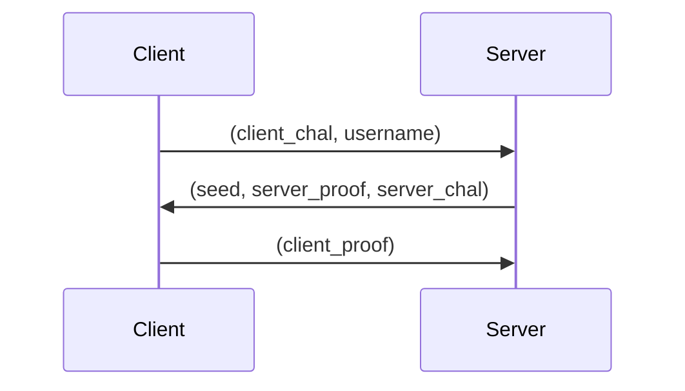
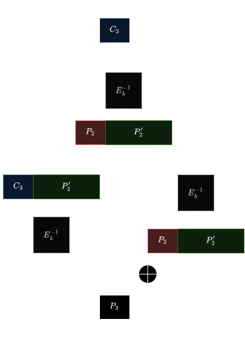

In this challenge, we have to break a custom encryption protocol.

This encryption protocol is not only custom, but also uses a custom block cipher mode.

## The authentication protocol


The `Key` that is used is derived using the user's `password` and the `seed`

The client verifies that:
`Dec(server_proof, Key) = client_chal || username || "server"`

Meanwhile, the server verifies that:
`Dec(client_proof, Key) = server_chal || ... || "server"`

With the central bytes not being verified:
```py
# During the reverse ingeneerie of the protocol, it appears that
# the user name is not verified by the server. Only the last 6 bytes
# are checked (after decryption) to correspond to "client".
```

## The crazy block cipher mode

Here is how this mode deciphers the last blocks (this holds for $2 \times l < 16$):



Notably, we have:
$$P_3 = C_3 \ \oplus \ P_2$$

## The vulnerability
### `server_chal`
`client_chal`, `server_chal`, `server_proof` and `client_proof` are the first 16 bytes so get ciphered independently.

Furthermore, there is no requirement / date / tag on the `client_chal`.

We can simply create a new session, and ask the server to encrypt its own challenge for us!

By providing this secondary `server_proof` as our `client_proof` we are able to move on to the next verification stage.

### `"client"`
The next challenge is figuring out how to append `"client"` at the end of our message.
We can take advantage of our knowledge of a plain text / cipher text pair to do so (and the fact that the server ignores the username)

To do so, we know $C_2$ (our cipher text), we know $P_2$ (our plain text) and $P_3$ (our target: `"client"`)

We can simply calculate $C_3$.

### Putting it together
Our response will correspond of
`server_proof` || $C_2$ || $C_3$

## Implementation
See the jupyter notebook

`ECW{authentifiction_9xniWVYniWzBmnq9cPG5FP1W}`